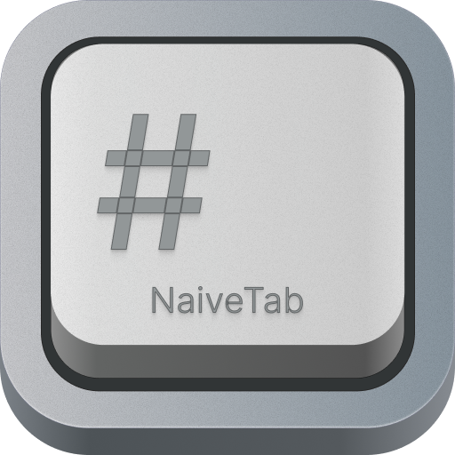

  
  <h1 align="center">NaiveTab</h1>
  
A minimal yet powerful new tab extension — turn every new tab into a productive starting point

  
English | <a href="https://github.com/GXFG/newtab-naivetab/blob/main/README.md">中文</a>

## 🌟 Features

### Built-in Widgets

| Widget | Description |
|--------|-------------|
| **⌨️ Bookmark Keyboard** | Display bookmarks as a physical keyboard layout for instant access. Set global shortcuts to open bookmarks from anywhere in the browser. |
| **📁 Folder Bookmarks** | Browse native bookmark folders in a grid. Navigate into/out of subfolders, toggle icon & label visibility, and freely adjust columns, gap, border-radius, and row height. Supports opening links in a new tab. |
| **🕐 Clock** | Digital clock, analog clock, flip clock, and neon clock — multiple styles to choose from. |
| **📆 Date** | Clean date display with customizable format and style. |
| **📅 Perpetual Calendar** | Includes lunar calendar, public holidays, and statutory holidays. Easily check working days and plan your schedule. |
| **📊 Year Progress** | Visualize how much of the year has passed with a day count, percentage, and dot grid. Make every day count. |
| **🔍 Search Bar** | Customizable search engine for quick searches right from your new tab. |
| **📝 Memo** | Editable notes and to-do lists — jot down ideas and tasks on the fly. |
| **🌤 Weather** | Real-time temperature, wind speed, humidity, daily indices, and severe weather alerts. Powered by QWeather. |
| **📰 News** | Aggregated trending content from Toutiao, Baidu, Zhihu, Sina Weibo, V2EX, and more — all in one place. |

### Core Capabilities

- 🖱️ **Free Layout** — Drag any widget anywhere on the screen; works across all screen resolutions
- 🎨 **Deep Customization** — Tune font, size, color, background, border, shadow, and blur for every widget
- 🖼️ **Custom Backgrounds** — Bing Photo of the Day, local images, or a single pinned wallpaper
- 🌗 **Auto Theme** — Automatically switches between light and dark mode based on system appearance
- 🎯 **Focus Mode** — Show only the widgets you need; toggle it instantly from the right-click menu
- ☁️ **Cross-device Sync** — Sync settings across devices via browser sync (sign-in required); export backups locally
- 🌐 **Multilingual** — Supports Simplified Chinese and English
- 🔒 **Open Source, Zero Data Collection** — No telemetry, no tracking. Your data stays yours

## 🚀 Get Started

- 📖 [Documentation](https://gxfg.github.io/naivetab-doc)
- ☕ [Buy me a coffee](https://github.com/GXFG/newtab-naivetab/blob/main/sponsor.md)

## 🛠️ Install

- [Chrome Web Store](https://chrome.google.com/webstore/detail/naivetab-%E6%96%B0%E6%A0%87%E7%AD%BE%E9%A1%B5/hhfebdcoeoddbdhgcgflblcjcgogijem)
- [Microsoft Edge Add-ons](https://microsoftedge.microsoft.com/addons/detail/naivetab-%E6%96%B0%E6%A0%87%E7%AD%BE%E9%A1%B5/kejadmppkffccjopodhekdnmkofidmjl)
- [Firefox Add-ons](https://addons.mozilla.org/en-US/firefox/addon/naivetab-%E6%96%B0%E6%A0%87%E7%AD%BE%E9%A1%B5)

## 📜 Changelog

[View the changelog](https://github.com/GXFG/newtab-naivetab/blob/main/CHANGELOG.md)

## 🌼 Acknowledgements

- [Naive UI](https://www.naiveui.com)
- [Vitesse-webext](https://github.com/antfu/vitesse-webext)
- [icones](https://icones.js.org)
